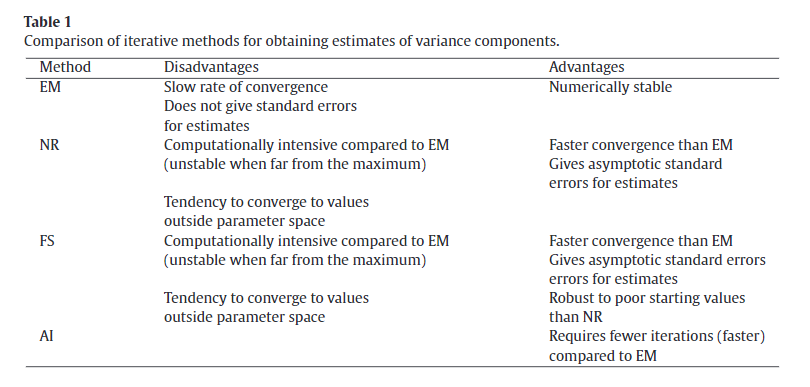

```{r setup, include=FALSE}
knitr::opts_chunk$set(echo = TRUE)
```

# Multiple Regression

## Moderation Effects

```{r, eval=FALSE}
lm(y ~ x1 + x2, data=dat)  # main effects + global mean
lm(y ~ x1:x2, data=dat)    # interaction effects
lm(y ~ x1 * x2, data=dat)  # x1*x2 = x1 + x2 + x1:x2
lm(y ~ x1^2, data=dat)     # x1*x1 = x1 + x1 + x1:x1

lm(y ~ x1 + x2 - 1,  data=dat)  # main effects WITHOUT intercept
lm(y ~ x1 + x2 + 0,  data=dat)  # main effects WITHOUT intercept
```

## Centering Variables

```{r}
x1 <- rnorm(100, 5, 1)
x2 <- rnorm(100, -3, 1)
e <- rnorm(100)
y <- (x1-3)*(x2+1) + 2*(x1-3) - (x2+1) + e
dat =data.frame(x1=x1, x2=x2, y=y)
fit1 <- lm(y ~ x1*x2, data=dat)
summary(fit1)
```

```{r}
dat2 = data.frame(x1=x1-mean(x1), x2=x2-mean(x2), y=y-mean(y))
fit2 <- lm(y ~ x1*x2, data=dat2)
summary(fit2)
```

## 모형 평가(Model Evaluation)

* MSE = **M**ean **S**quared **E**rror
* RMSE = **R**oot **M**ean **S**quared **E**rror
* $R^2$ = explained variance over total variance
* adj. $R^2$ 
* AIC(**A**kaike **I**nformation **C**riterion) 
$$-2\log L + 2p$$
* BIC(**B**ayesian **I**nformation **C**riterion) 
$$-2\log L + p \log n$$

```{r}
mean(resid(fit1)^2) # MSE
sqrt(mean(resid(fit1)^2)) # RMSE

summary(fit1)$r.squared # R^2
summary(fit1)$adj.r.squared # adj. R^2

AIC(fit1)
BIC(fit1)
```


## 모형 선택(Model Selection)

* 내포(Nested)된 모형인 경우 : 아래 예에서 `y ~ x1 + x2`는 `y ~ x1 + x2 + x1:x2`에서 `x1:x2`의 계수가 0인 특별한 경우로 생각할 수 있다. 

```{r}
fit1 <- lm(y~ x1 + x2 , data = dat)
fit2 <- lm(y~ x1 + x2 + x1:x2, data=dat)
anova(fit1, fit2)
library(lmtest)
waldtest(fit1, fit2)
lrtest(fit1, fit2)
```

* 내포되지 않은 경우

```{r}
# 데이터
x1 <- rnorm(100, 5, 1)
x2 <- rnorm(100, -3, 1)
e <- rnorm(100, 0, 2)
y <- (x1-3)*(x2+1) + 0.7*x1^2 + 2*(x1-3) - (x2+1) + e
dat =data.frame(x1=x1, x2=x2, y=y)
```

```{r}
fit1 <- lm(y ~ x1*x2, data=dat)
summary(fit1)
```


```{r}
fit1 <- lm(y~ x1 + x2 + x1:x2, data = dat)
fit2 <- lm(y~ x1 + x2 + I(x1^2), data=dat)
#anova(fit1, fit2)
AIC(fit1, fit2)
BIC(fit1, fit2)
```
그 밖에도 교차검증(CV; **C**ross-**V**alidation) 등을 사용할 수 있다. 

```{r}
library(caret) # install.packages('caret')
train_ctrl <- trainControl(method = "cv", number = 5)
fit1 <- train(y~ x1 + x2 + x1:x2,   # model to fit
              data = dat,                        
              trControl = train_ctrl,             
              method = "lm",                      
              na.action = na.pass)    
print(fit1$results)
```

```{r}
fit2 <- train(y~ x1 + x2 + I(x1^2),   # model to fit
              data = dat,                        
              trControl = train_ctrl,             
              method = "lm",                      
              na.action = na.pass)    
print(fit2$results)
```

```{r}
# 비교
print(rbind(fit1$results, fit2$results))
```


---

# Mixed Effects Model

임의 효과(Random Effects)를 모형에 추가하는 이유는 predictor가 많을 수록 $R^2$ (설명력)이 증가하는 것과 비슷하다.

# Mixed Effects Model

Linear Mixed Effects Model은 Linear Mixed Model, Multilevel model, Hierarchical Linear Model, random coefficient model으로도 불린다. 흔히 군집 자료(clustered data) 또는 종단자료(longitudinal data) 분석에 쓰인다.

* **핵심**은 관찰값이 서로 독립이 아니기 때문에 독립을 가정한 방법을 사용하면 **편향(bias)**이 발생할 수 있으며, **오류율**이나 **신뢰구간**이 잘못 계산된다. 다시 말해 추정량의 평균과 분산을 잘못 계산하게 된다.
  - 한 가지 방법은 **기존의 방법**을 사용하는 것이다. 예를 들면, 반복 측정의 경우에는 반복 측정 값의 평균을 사용할 수 있다.
  - **기존의 방법**을 사용하면 가정이 어긋나면서 오류율이 커지는 경우에는 자유도를 조정하는 등의 방법을 사용하여 **오류율을 유의수준 이하로 통제**한다(예. Welch's t-test, Greenhouse-Geisser and Huynh-Feldt Corrections 등).
  - 마지막 방법은 새로운 모형을 만들어서 어긋난 가정을 적절하게 모형에 포함시키는 것이다.
  
## 독립에서 얼마나 벗어나 있는가?
  
만약 관찰값의 분산-공분산 구조를 고려하지 않는다면, 분석의 결과가 얼마나 잘못될까? 이 질문은 주어진 데이터가 **독립에서 얼마나 벗어나 있는가?**로 바꿀 수 있다. 이에 대한 대답으로 intraclass correlation coefficient를 사용할 수 있다.

* ICC(**I**ntraclass **C**orrelation **C**oefficient) 
    - $\frac{\sigma_{u}^2}{\sigma_{u}^2 +\sigma_{e}^2}$ ( $\sigma_{u}^2$ : 집단 평균의 분산, $\sigma_{e}^2$ : 집단 내 (공통) 분산 )
    - $\frac{\sigma_{u}^2}{\sigma_{u}^2 +\sigma_{e}^2}$ 의 분모, 분자를 모두 $\sigma_u^2$ 로 나누면, $\frac{1}{1 +(\frac{\sigma_{e}}{\sigma_u})^2}$ 이 된다.
    - 아래 그래프에서 보는 바와 같이 집단 내 분산과 집단 간 분산의 비에 따라 ICC가 결정된다.
    
```{r}
curve(1+1/(x^2), xlim=c(0.5,1.5), main = "ICC, x = sigma_e/sigma_u")
```
    
## Model

### 벡터 표현

$$Y_{ij} = \vec{x_{ij}}^\intercal\vec{\beta} + \vec{u_{ij}}^\intercal\vec{\gamma_i} + \epsilon_{ij}$$

* $\vec{\beta}$ : 고정 효과(fixed effect)
* $\vec{u}$ : 임의 효과(random effect)

### Random intercept model/Random slope model

* Random intercept model

$$y_{ij} = (\beta_0 + u_0) + \beta_1 x_{ij1} + \beta_2 x_{ij2} + \cdots + e_{ij}$$

* Random slope model

$$y_{ij} = (\beta_0 + u_0) + (\beta_1 + u_1) x_{ij1} + (\beta_2 + u_2) x_{ij2} + \cdots + e_{ij}$$

여기서 $u_0$ , $u_1$ , $u_2$ 는 모두 평균이 0인 정규분포를 따른다고 가정한다.


## 추정방법

* MLE
* REML(**RE**stricted **M**aximum **L**ikelihood estimate) : 분산 추정이 좀 더 정확한 것으로 알려져 있다.
* 베이지언 

MLE은 분산 추정을 위해 SSE(**S**um of **S**quares **E**rror)에 자료수를 나눠주고, REML은 자료수 - 1을 나눈다. 

### 계산 

* 계산 방법
  - **N**ewton-**R**aphson algorithm
  - **F**isher **S**coring algorithm
  - **E**xpectation **M**aximization algorithm
  - **A**verage **I**nformation algorithm



* 용어
  - 수렴(convergence) : 최적의 해를 찾았다는 의미. 최적의 해를 찾는 방법이 반복적으로 가능한 해를 제시하고, 이를 확인하는 과정이므로, 최적의 해임을 확인하는 방법이 필요하다. 하지만 완벽하게 정확한 값을 찾기는 어렵기 때문에 어느 정도에서 최적의 해임을 확인하면 계산을 마치게 된다.
  - 초기값 : 가능한 해를 제시하는 첫번째 값. 이 값을 기준으로 가능한 해를 조금씩 바꿔간다.

* 계산 방법, 초기값 설정, 수렴 확인 방법을 어떻게 설정하느냐에 따라 다른 추정값을 얻을 수도 있다. (예. 참고 자료: 사용하는 함수에 따라 다른 값이 추정되는 경우)


## 고정 효과 모형과 비교

* shrinkage effect
  - 예를 들어 임의 절편(random intercept) 모형에서 집단 별 절편은 전체 절편 평균으로 쏠리게 된다.
  
* 임의 계수 모형과 고정 효과 모형을 비교해보면, 고정 효과 모형은 계수 추정량의 평균이 편향될 수 있다.

## R

```{r, eval=FALSE}
library(lme4) fit.lmer <- lmer()
library(lmer) fit.lme <- lme()
```

```{r, eval=FALSE}
library(lme4)
library(lmerTest)
fit.lmer <- lmer(value ~ key + (1|subj), data= dat2)
summary(fit.lmer)
confint(fit.lmer)

library(nlme)
dat2$subj = factor(dat2$subj)
fit.lme <- lme(value ~ key, random = ~ 1|subj , data= dat2)
summary(fit.lme)
intervals(fit.lme)
```

### Repeated Measures ANOVA

```{r}
library(dplyr)
library(tidyr)
dat <- read.table('https://www.uvm.edu/~statdhtx/fundamentals8/DataFiles/Tab18-2.dat', 
                  header=TRUE)
dat <- dat %>% mutate(subj = 1:nrow(dat))
dat <- dat %>% mutate(subj = factor(subj))
datLong <- dat %>% 
  gather(key='key', value='value',
                  COUNT:INTENT)
head(datLong)
fit.aov <- aov(value ~ key + Error(subj/key), data = datLong)
summary(fit.aov)
#plot(fit.aov)
#resid_panel(fit.aov)
library(emmeans)
m.aov <- lsmeans(fit.aov, 'key')
pairs(m.aov)
```

```{r}
library(afex)
fit.aov_car <- aov_car(value ~ key + Error(subj/key), data =datLong)
summary(fit.aov_car)
#plot(fit.aov_car)
#confint(fit.aov_car)
coef(fit.aov_car)
m.aov_car <- lsmeans(fit.aov_car, 'key')
pairs(m.aov_car)
```

### Mixed Effects Model

```{r}
library(lme4)
library(lmerTest)
fit.lmer <- lmer(value ~ key + (1|subj), datLong)
summary(fit.lmer)
fit2.lmer <- lmer(value ~ key + (1|subj), datLong, 
                  contrasts = list(key=contr.sum))
summary(fit2.lmer)
plot(fit.lmer)
library(ggResidpanel) # install.packages('ggResidpanel')
# 적합 확인
resid_panel(fit.lmer)
resid_xpanel(fit.lmer)
# 신뢰구간
confint(fit.lmer)
```

```{r}
library(nlme)
fit.lme <- lme(value ~ key, random = ~1|subj, datLong)
summary(fit.lme)
plot(fit.lme)
resid_panel(fit.lme)
resid_xpanel(fit.lme)
intervals(fit.lme)
```


## 신뢰구간/유의성 검정

## 적합도, 모형선택

* Model Information 

  - AIC(**A**kaike **I**nformation **C**riterion)
  - BIC(**B**ayesian **I**nformation **C**riterion)

* 모형 선택하기 

  - Information Criterion
  - 이론과 부합하는가?

## 가정이 어긋났을 때

* `robustlmm`
[robustlmm](figure/roboustlmm.png)


## 참고 문헌/참고자료

* [Evaluatio Metrics](https://daviddalpiaz.github.io/appliedstats/model-selection.html)
* [SPSS에서 Mixed Data 분석](http://www.stat.cmu.edu/~hseltman/309/Book/chapter15.pdf)
* [사용하는 함수에 따라 다른 값이 추정되는 경우](https://stats.stackexchange.com/questions/385670/completely-different-results-from-lme-and-lmer)
* Gumedze, F. N., & Dunne, T. T. (2011). Parameter estimation and inference in the linear mixed model. Linear Algebra and Its Applications, 435(8), 1920–1944. https://doi.org/10.1016/j.laa.2011.04.015
* [Choosing among nested var-covar models](https://stats.stackexchange.com/questions/99895/why-does-one-have-to-use-reml-instead-of-ml-for-choosing-among-nested-var-cova/171529#171529)
* [glmm FAQ](http://bbolker.github.io/mixedmodels-misc/glmmFAQ.html)
